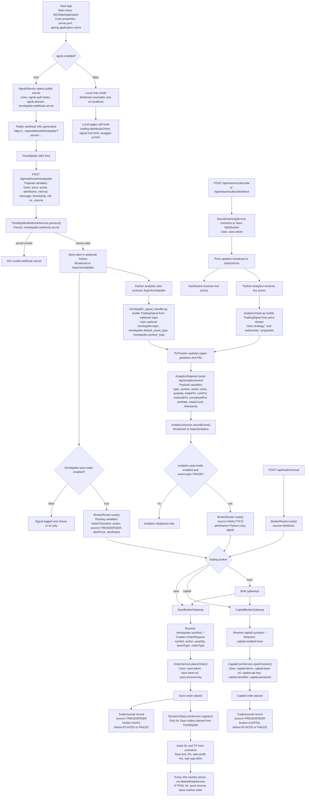

# System Flow And Property Map

This document is the code-based flow chart for the current project. It explains:

- how the app starts
- how a TrendSpider alert becomes a trade
- how Saxo streaming reaches the dashboard and Python analytics
- how Python analytics can send events back into Spring
- what each runtime variable means
- what each configuration property controls

## 1. Complete System Flow Chart



## 2. Flow Chart Legend

### Startup properties

| Property | Meaning |
|---|---|
| `server.port` | HTTP port for Spring Boot, local dashboard, Swagger, and WebSocket |
| `spring.application.name` | Application name shown inside Spring configuration |
| `ngrok.enabled` | Enables or disables automatic ngrok startup |
| `ngrok.auth-token` | Auth token used by `NgrokService` |
| `ngrok.domain` | Static public ngrok domain, if claimed |

### TrendSpider path properties

| Property | Meaning |
|---|---|
| `trendspider.webhook.secret` | Secret accepted by `/api/webhook/trendspider` |
| `trendspider.auto-trade-enabled` | If `true`, webhook signals place broker orders |
| `trading.broker` | Selects `saxo`, `capital`, or `both` |
| `trendspider.symbols.<TICKER>.saxo-symbol` | Saxo instrument name for an incoming ticker |
| `trendspider.symbols.<TICKER>.asset-type` | Saxo asset type for that ticker |
| `trendspider.symbols.<TICKER>.quantity` | Saxo quantity for that ticker |

### Saxo order properties

| Property | Meaning |
|---|---|
| `saxo.token` | Bearer token for Saxo REST and Saxo streaming |
| `saxo.base-url` | Saxo REST base URL |
| `saxo.account-key` | Saxo account identifier used in order and portfolio calls |

### Capital.com properties

| Property | Meaning |
|---|---|
| `capital.enabled` | Enables Capital.com integration and routes |
| `capital.demo` | Chooses demo or live mode |
| `capital.base-url` | Capital.com API base URL |
| `capital.api-key` | API key for Capital.com |
| `capital.identifier` | Capital.com login identifier |
| `capital.password` | Capital.com password |
| `capital.symbols.<TICKER>.epic` | Capital market epic for that ticker |
| `capital.symbols.<TICKER>.size` | Capital trade size for that ticker |

### Analytics path properties

| Property | Meaning |
|---|---|
| `analytics.auto-trade-enabled` | If `true`, Spring places orders from Python analytics `TRADE` events |
| `spring.base_url` | Base URL Python uses for REST posts back to Spring |
| `analytics.reporter.enabled` | Turns Python event posting on or off |
| `websocket.base_url` | Python SockJS/STOMP base URL |
| `websocket.topic` | Python price topic, normally `/topic/prices` |
| `websocket.reconnect_delay_seconds` | Delay between reconnect attempts |
| `websocket.max_reconnect_attempts` | Maximum reconnect tries |
| `trendspider.topic` | Optional Python subscription override for TrendSpider topic |
| `trendspider.default_asset_type` | Default asset type attached to TrendSpider-derived Python signals |
| `trendspider.symbol_map` | Optional ticker remap, for example `GER40:Germany 40` |

### Strategy properties

| Property | Meaning |
|---|---|
| `watched.symbols` | Human-readable symbols that define the analytics watch list |
| `watched.assetType` | Saxo asset type for the watch list |
| `strategy.levy_alpha_init` | Initial Lévy alpha seed |
| `strategy.levy_beta` | Initial skewness seed |
| `strategy.levy_tail_fraction` | Fraction used by the Hill tail estimator |
| `strategy.window_size` | Rolling window for returns and momentum |
| `strategy.momentum_decay_min` | Lower EWMA decay bound |
| `strategy.momentum_decay_max` | Upper EWMA decay bound |
| `strategy.volatility_lookback` | Volatility lookback bars |
| `strategy.quantity_per_trade` | Default fallback quantity |
| `strategy.min_sizes` | Per-symbol quantity overrides |
| `strategy.signal_threshold_buy` | Momentum threshold for BUY |
| `strategy.signal_threshold_sell` | Momentum threshold for SELL |
| `strategy.min_data_points` | Minimum ticks before signals can fire |

### UI and support properties

| Property | Meaning |
|---|---|
| `trading.manual-orders-enabled` | Only gates `POST /api/orders`; it does not gate `/api/trade/manual` |
| `logging.level.com.trading` | Spring logging level for app packages |
| `logging.level.org.springframework.web.servlet.resource` | Spring resource logging noise control |
| `springdoc.swagger-ui.path` | Swagger UI path |
| `springdoc.api-docs.path` | OpenAPI JSON path |
| `preset.<name>.label` | Dashboard preset display name |
| `preset.<name>.symbols` | Dashboard preset symbols |
| `preset.<name>.assetType` | Dashboard preset asset type |
| `logging.level` | Python logging level |
| `logging.file` | Python log file path |
| `logging.format` | Python log format |

## 3. Runtime Variable Dictionary

### 3.1 TrendSpider webhook payload variables

These are the fields sent to `POST /api/webhook/trendspider`.

| Variable | Meaning |
|---|---|
| `ticker` | Incoming TrendSpider symbol such as `XAUUSD`, `CL1!`, `GER40` |
| `price` | Alert price sent by TrendSpider |
| `action` | Signal side, usually `BUY` or `SELL` |
| `alertName` | Name of the TrendSpider alert |
| `interval` | Chart interval such as `5m`, `1h`, `1d` |
| `message` | Free-text alert message |
| `timestamp` | Time the alert fired |
| `mfi` | Optional Money Flow Index value |
| `rsi` | Optional RSI value |
| `volume` | Optional volume value |
| `extras` | Any unknown extra fields are captured here |

### 3.2 Router variables

These are the variables passed into `BrokerRouter.route(...)`.

| Variable | Meaning |
|---|---|
| `tickerOrSymbol` | Either a TrendSpider ticker or a Saxo-style symbol |
| `action` | `BUY` or `SELL` |
| `source` | `TRENDSPIDER`, `MANUAL`, or `ANALYTICS` |
| `alertPrice` | Price associated with the signal |
| `alertName` | Human-readable label stored in the trade journal |

### 3.3 Saxo `OrderRequest` variables

| Variable | Meaning |
|---|---|
| `symbol` | Final Saxo symbol used in instrument lookup |
| `action` | `BUY` or `SELL` |
| `quantity` | Contracts, lots, or units |
| `assetType` | Saxo asset type such as `CfdOnIndex`, `CfdOnFutures`, `FxSpot` |
| `orderType` | `MKT`, `LMT`, or `STP` |
| `limitPrice` | Used only for limit orders |
| `stopPrice` | Used only for stop orders |

### 3.4 Trade journal variables

| Variable | Meaning |
|---|---|
| `id` | Journal record ID such as `TJ-1` |
| `timestamp` | Time the journal entry was created |
| `source` | `TRENDSPIDER`, `MANUAL`, or `ANALYTICS` |
| `ticker` | Raw incoming ticker |
| `saxoSymbol` | Mapped Saxo symbol |
| `assetType` | Broker-side asset type |
| `action` | `BUY` or `SELL` |
| `quantity` | Trade size |
| `alertPrice` | Original signal price |
| `alertName` | Alert label such as `manual-test` or `Python Lévy signal` |
| `broker` | `SAXO` or `CAPITAL` |
| `orderId` | Saxo order ID or Capital deal reference stored in the same field |
| `status` | `PLACED` or `FAILED` |
| `failReason` | Broker failure reason |

### 3.5 Python `TradingSignal` variables

| Variable | Meaning |
|---|---|
| `symbol` | Signal symbol seen by Python |
| `signal_type` | `BUY`, `SELL`, or `HOLD` |
| `momentum_value` | Momentum score |
| `levy_alpha` | Estimated Lévy stability parameter |
| `confidence` | Confidence score in `[0,1]` |
| `timestamp` | Python signal time |
| `price` | Signal price |
| `asset_type` | Asset type carried with the signal |
| `reason` | Why the signal was generated |

### 3.6 `AnalyticsEvent` variables

| Variable | Meaning |
|---|---|
| `type` | Current Python reporter sends `TRADE` or `PNL_UPDATE` |
| `symbol` | Analytics symbol |
| `action` | `BUY`, `SELL`, or `HOLD` |
| `price` | Event price |
| `quantity` | Current quantity summary sent by Python |
| `tradePnl` | Trade-level P&L |
| `cumPnl` | Cumulative P&L |
| `realizedPnl` | Realized P&L |
| `unrealizedPnl` | Unrealized P&L |
| `winRate` | Win rate percentage |
| `tradeCount` | Number of closed trades |
| `timestamp` | Event timestamp |

## 4. Spring Boot Property Reference

Spring Boot reads these values from `src/main/resources/application.properties`. The same keys can also be overridden by uppercase environment variables using Spring's relaxed binding, for example `NGROK_AUTH_TOKEN` for `ngrok.auth-token`.

### 4.1 Core properties

| Property | Current purpose | Where used |
|---|---|---|
| `server.port` | Local HTTP port | Spring Boot, `NgrokService`, config model |
| `spring.application.name` | App name | config model |
| `saxo.token` | Saxo auth token | `SaxoConfig`, REST, streaming |
| `saxo.base-url` | Saxo API base URL | `SaxoConfig`, REST services |
| `saxo.account-key` | Saxo account key | `SaxoConfig`, orders, portfolio |

### 4.2 Safety and routing properties

| Property | Current purpose | Where used |
|---|---|---|
| `trading.manual-orders-enabled` | Gates only `/api/orders` | `OrderController` |
| `trading.broker` | Selects `saxo`, `capital`, or `both` | `BrokerRouter`, config model |
| `analytics.auto-trade-enabled` | Turns analytics event execution on or off | `AnalyticsService` |
| `trendspider.webhook.secret` | Validates incoming webhook | `TrendSpiderWebhookService`, `NgrokService`, `NgrokController`, config model |
| `trendspider.auto-trade-enabled` | Turns TrendSpider execution on or off | `TrendSpiderWebhookService` via `TrendSpiderSymbolConfig` |

### 4.3 ngrok properties

| Property | Current purpose | Where used |
|---|---|---|
| `ngrok.enabled` | Auto-start ngrok tunnel | `NgrokService`, config model |
| `ngrok.auth-token` | ngrok authentication | `NgrokService` |
| `ngrok.domain` | Fixed public tunnel domain | `NgrokService`, config model |

### 4.4 Swagger and logging properties

| Property | Current purpose | Where used |
|---|---|---|
| `logging.level.com.trading` | App log verbosity | Spring logging |
| `logging.level.org.springframework.web.servlet.resource` | Static resource logging | Spring logging |
| `springdoc.swagger-ui.path` | Swagger page path | SpringDoc |
| `springdoc.api-docs.path` | OpenAPI JSON path | SpringDoc |

### 4.5 Preset property family

Pattern:

- `preset.<name>.label`
- `preset.<name>.symbols`
- `preset.<name>.assetType`

Current preset groups:

| Preset | Label | Symbols | Asset type |
|---|---|---|---|
| `preset.indices.*` | `Indices` | `Germany 40,Netherlands 25` | `CfdOnIndex` |
| `preset.metals.*` | `Metals` | `XAUUSD,XAGUSD` | `FxSpot` |
| `preset.energy.*` | `Energy` | `Crude Oil WTI,Brent Crude` | `CfdOnFutures` |
| `preset.stocks.*` | `US Stocks` | `AAPL,TSLA,MSFT,NVDA,AMZN` | `CfdOnStock` |

### 4.6 TrendSpider to Saxo mapping family

Pattern:

- `trendspider.symbols.<ALIAS>.saxo-symbol`
- `trendspider.symbols.<ALIAS>.asset-type`
- `trendspider.symbols.<ALIAS>.quantity`

Current aliases from `application.properties`:

| Alias group | Aliases | Saxo symbol | Asset type | Quantity |
|---|---|---|---|---|
| Gold | `XAUUSD`, `GOLD`, `XAU`, `GC` | `Gold` | `FxSpot` | `1` |
| Silver | `XAGUSD`, `SILVER`, `XAG`, `SI` | `Silver` | `FxSpot` | `1` |
| WTI | `OIL`, `USOIL`, `WTICOUSD`, `CL`, `[CL1!]`, `WTI` | `Crude Oil WTI` | `CfdOnFutures` | `10` |
| Brent | `BRENT`, `UKOIL`, `BCO` | `Brent Crude` | `CfdOnFutures` | `10` |
| Germany 40 | `GER40`, `DAX`, `DE40`, `GER30` | `Germany 40` | `CfdOnIndex` | `1` |
| US Tech 100 | `NAS100`, `US100`, `NDX`, `NASDAQ`, `USTECH`, `[NQ1!]`, `NQ` | `US Tech 100` | `CfdOnIndex` | `1` |
| Netherlands 25 | `AEX`, `NL25` | `Netherlands 25` | `CfdOnIndex` | `1` |

### 4.7 TrendSpider symbol properties by exact key

This is the exact key pattern currently used in the file:

```text
trendspider.symbols.XAUUSD.saxo-symbol
trendspider.symbols.XAUUSD.asset-type
trendspider.symbols.XAUUSD.quantity
...
trendspider.symbols.[CL1!].saxo-symbol
trendspider.symbols.[CL1!].asset-type
trendspider.symbols.[CL1!].quantity
...
trendspider.symbols.[NQ1!].saxo-symbol
trendspider.symbols.[NQ1!].asset-type
trendspider.symbols.[NQ1!].quantity
```

Use the same three-key pattern for any new ticker alias you add.

### 4.8 Capital mapping family

Pattern:

- `capital.symbols.<ALIAS>.epic`
- `capital.symbols.<ALIAS>.size`

Current aliases from `application.properties`:

| Alias group | Aliases | Capital epic | Size |
|---|---|---|---|
| WTI | `[CL1!]`, `CL`, `WTI`, `USOIL` | `OIL_CRUDE` | `1` |
| US100 | `[NQ1!]`, `NQ`, `NAS100`, `NASDAQ` | `US100` | `1` |
| Gold | `XAUUSD`, `GOLD`, `Gold` | `GOLD` | `1` |
| Silver | `XAGUSD`, `SILVER`, `Silver` | `SILVER` | `1` |
| Germany 40 | `GER40`, `DAX`, `GERMANY_40` | `DE30` | `1` |
| Brent | `BRENT`, `BRENT_CRUDE` | `OIL` | `1` |
| Saxo-style WTI name | `CRUDE_OIL_WTI` | `OIL_CRUDE` | `1` |
| Saxo-style US100 name | `US_TECH_100` | `US100` | `1` |
| Saxo-style Netherlands 25 name | `NETHERLANDS_25` | `AEX` | `1` |

## 5. Python Property Reference

Python reads `analytics/config/strategy.properties`.

### 5.1 Connection properties

| Property | Current purpose | Where used |
|---|---|---|
| `spring.base_url` | Base URL for REST posts and support calls | `AnalyticsReporter` |
| `analytics.reporter.enabled` | Enables or disables posting to Spring | `AnalyticsReporter` |
| `websocket.base_url` | SockJS/STOMP base URL | `SockJsStompClient` |
| `websocket.topic` | Price topic to subscribe to | `run_strategy` |
| `websocket.reconnect_delay_seconds` | Reconnect delay | `SockJsStompClient` |
| `websocket.max_reconnect_attempts` | Max reconnect count | `SockJsStompClient` |
| `trendspider.topic` | Optional TrendSpider topic override | `run_strategy` |
| `trendspider.default_asset_type` | Default asset type attached to TrendSpider-origin signals | `TrendSpiderSignalHandler` |
| `trendspider.symbol_map` | Optional remap from TrendSpider tickers to Saxo-style names | `build_trendspider_handler` |

### 5.2 Watch list and strategy properties

| Property | Current purpose | Where used |
|---|---|---|
| `watched.symbols` | Strategy watch list | strategy config |
| `watched.assetType` | Watch list asset type | strategy config |
| `strategy.levy_alpha_init` | Lévy alpha seed | strategy config |
| `strategy.levy_beta` | Lévy beta seed | strategy config |
| `strategy.levy_tail_fraction` | Tail estimator input | strategy config |
| `strategy.window_size` | Momentum window length | `SignalGenerator` |
| `strategy.momentum_decay_min` | Lower adaptive decay bound | `SignalGenerator` |
| `strategy.momentum_decay_max` | Upper adaptive decay bound | `SignalGenerator` |
| `strategy.volatility_lookback` | Volatility lookback size | `SignalGenerator` |
| `strategy.quantity_per_trade` | Fallback position size | `PnlTracker` |
| `strategy.min_sizes` | Per-symbol sizes | `PnlTracker` |
| `strategy.signal_threshold_buy` | BUY threshold | `SignalGenerator` |
| `strategy.signal_threshold_sell` | SELL threshold | `SignalGenerator` |
| `strategy.min_data_points` | Minimum ticks before action | `SignalGenerator` |

### 5.3 Python logging properties

| Property | Current purpose | Where used |
|---|---|---|
| `logging.level` | Log level | `configure_logging` |
| `logging.file` | Log destination file | `configure_logging` |
| `logging.format` | Log line format | `configure_logging` |

## 6. Practical Reading Guide

If you are debugging the app, follow this order:

1. Check `application.properties`
2. Start Spring Boot
3. Confirm `/api/ngrok/url` returns the public webhook URL
4. Send a test webhook to `/api/webhook/trendspider`
5. Check `/api/webhook/trendspider/history`
6. Check `/api/trades/journal`
7. If Saxo price streaming matters, start `/api/stream/subscribe`
8. If Python matters, start `analytics/main.py`
9. Check `/api/analytics/history`

## 7. What is configurable vs hard-coded

Configurable by property:

- broker choice
- webhook secret
- auto-trade switches
- ngrok startup
- symbol mappings
- Capital routing
- analytics strategy thresholds
- watch list
- log levels

Hard-coded in Java/Python right now:

- dynamic stop loss percent = `2%`
- dynamic take profit percent = `4%`
- trailing lock ratio = `60%`
- stop-loss monitor interval = `20 seconds`
- analytics HOLD post throttle = `5 seconds`
- analytics post timeout = `3 seconds`

